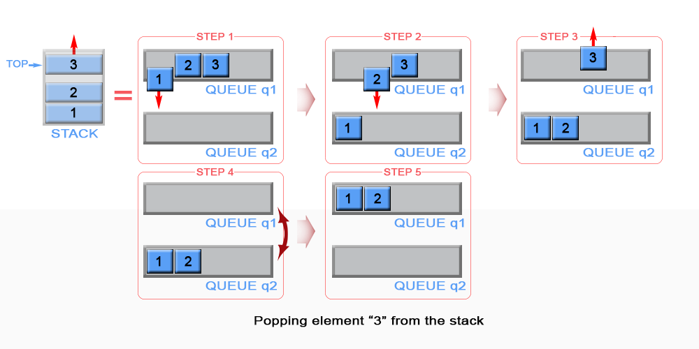

#Explain
Implement the following operations of a stack using queues.

push(x) -- Push element x onto stack.
pop() -- Removes the element on top of the stack.
top() -- Get the top element.
empty() -- Return whether the stack is empty.
Notes:
You must use only standard operations of a queue -- which means only push to back, peek/pop from front, size, and is empty operations are valid.
Depending on your language, queue may not be supported natively. You may simulate a queue by using a list or deque (double-ended queue), as long as you use only standard operations of a queue.
You may assume that all operations are valid (for example, no pop or top operations will be called on an empty stack).
Credits:
Special thanks to @jianchao.li.fighter for adding this problem and all test cases.

Summary
This article is for beginners. It introduces the following ideas: Stack, Queue.

Solution
Approach #1 (Two Queues, push - O(1)O(1), pop O(n)O(n) )
Intuition

Stack is LIFO (last in - first out) data structure, in which elements are added and removed from the same end, called top. In general stack is implemented using array or linked list, but in the current article we will review a different approach for implementing stack using queues. In contrast queue is FIFO (first in - first out) data structure, in which elements are added only from the one side - rear and removed from the other - front. In order to implement stack using queues, we need to maintain two queues q1 and q2. Also we will keep top stack element in a constant memory.

Algorithm

Push

The new element is always added to the rear of queue q1 and it is kept as top stack element

Push an element in stack

Figure 1. Push an element in stack

Java

private Queue<Integer> q1 = new LinkedList<>();
private Queue<Integer> q2 = new LinkedList<>();
private int top;

// Push element x onto stack.
public void push(int x) {
    q1.add(x);
    top = x;
}
Complexity Analysis

Time complexity : O(1)O(1). Queue is implemented as linked list and add operation has O(1)O(1) time complexity.

Space complexity : O(1)O(1)

Pop

We need to remove the element from the top of the stack. This is the last inserted element in q1. Because queue is FIFO (first in - first out) data structure, the last inserted element could be removed only after all elements, except it, have been removed. For this reason we need to maintain additional queue q2, which will serve as a temporary storage to enqueue the removed elements from q1. The last inserted element in q2 is kept as top. Then the algorithm removes the last element in q1. We swap q1 with q2 to avoid copying all elements from q2 to q1.

Pop an element from stack

Figure 2. Pop an element from stack

Java

        // Removes the element on top of the stack.
        public void pop() {
            while (q1.size() > 1) {
                top = q1.remove();
                q2.add(top);
            }
            q1.remove();
            Queue<Integer> temp = q1;
            q1 = q2;
            q2 = temp;
        }
Complexity Analysis

Time complexity : O(n)O(n). The algorithm dequeues n elements from q1 and enqueues n - 1n−1 elements to q2, where nn is the stack size. This gives 2n - 12n−1 operations.
Space complexity : O(1)O(1).
Approach #2 (Two Queues, push - O(n)O(n), pop O(1)O(1) )
Algorithm

Push

The algorithm inserts each new element to queue q2 and keep it as the top element. In case queue q1 is not empty (there are elements in the stack), we remove all elements from q1 and add them to q2. In this way the new inserted element (top element in the stack) will be always positioned at the front of q2. We swap q1 with q2 to avoid copying all elements from q2 to q1.

Push an element in stack

Figure 3. Push an element in stack

Java

        public void push(int x) {
            q2.add(x);
            top = x;
            while (!q1.isEmpty()) {                
                q2.add(q1.remove());
            }
            Queue<Integer> temp = q1;
            q1 = q2;
            q2 = temp;
        }
Complexity Analysis

Time complexity : O(n)O(n). The algorithm removes n elements from q1 and inserts n + 1n+1 elements to q2, where n is the stack size. This gives 2n + 12n+1 operations. The operations add and remove in linked lists has O(1)O(1) complexity.

Space complexity : O(1)O(1).

Pop

The algorithm dequeues an element from queue q1 and keeps front element of q1 as top.

Pop an element from stack

Figure 4. Pop an element from stack

        Java
        
        // Removes the element on top of the stack.
        public void pop() {
            q1.remove();
            if (!q1.isEmpty()) {
                top = q1.peek();
            }
        }
Complexity Analysis

Time complexity : O(1)O(1).
Space complexity : O(1)O(1).
In both approaches empty and top operations have the same implementation.

Empty

Queue q1 always contains all stack elements, so the algorithm checks q1 size to return if the stack is empty.

        // Return whether the stack is empty.
        public boolean empty() {
            return q1.isEmpty();
        }
Time complexity : O(1)O(1).

Space complexity : O(1)O(1).

Top

The top element is kept in constant memory and is modified each time when we push or pop an element.

        // Get the top element.
        public int top() {
            return top;
        }
Time complexity : O(1)O(1). The top element has been calculated in advance and only returned in top operation.

Space complexity : O(1)O(1).

Approach #3 (One Queue, push - O(n)O(n), pop O(1)O(1) )
The mentioned above two approaches have one weakness, they use two queues. This could be optimized as we use only one queue, instead of two.

Algorithm

Push

When we push an element into a queue, it will be stored at back of the queue due to queue's properties. But we need to implement a stack, where last inserted element should be in the front of the queue, not at the back. To achieve this we can invert the order of queue elements when pushing a new element.

Push an element in stack

Figure 5. Push an element in stack

Java

private LinkedList<Integer> q1 = new LinkedList<>();

        // Push element x onto stack.
        public void push(int x) {
            q1.add(x);
            int sz = q1.size();
            while (sz > 1) {
                q1.add(q1.remove());
                sz--;
            }
        }
Complexity Analysis

Time complexity : O(n)O(n). The algorithm removes n elements and inserts n + 1n+1 elements to q1 , where n is the stack size. This gives 2n + 12n+1 operations. The operations add and remove in linked lists has O(1)O(1) complexity.

Space complexity : O(1)O(1).

Pop

The last inserted element is always stored at the front of q1 and we can pop it for constant time.

Java

        // Removes the element on top of the stack.
        public void pop() {
            q1.remove();
        }
Complexity Analysis

Time complexity : O(1)O(1).
Space complexity : O(1)O(1).
Empty

Queue q1 contains all stack elements, so the algorithm checks if q1 is empty.

        // Return whether the stack is empty.
        public boolean empty() {
            return q1.isEmpty();
        }
Time complexity : O(1)O(1).

Space complexity : O(1)O(1).

Top

The top element is always positioned at the front of q1. Algorithm return it.

        // Get the top element.
        public int top() {
            return q1.peek();
        }
Time complexity : O(1)O(1).

Space complexity : O(1)O(1).

Analysis written by: @elmirap.